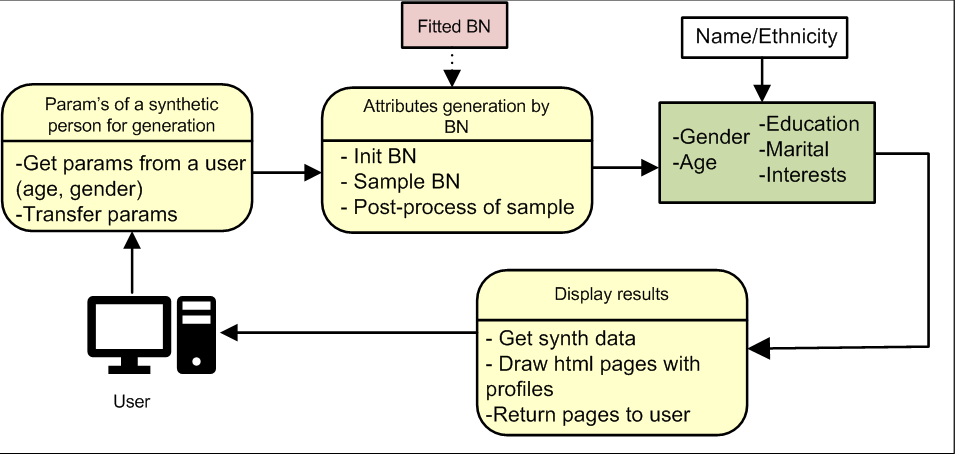
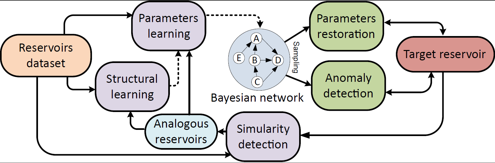

.. image:: /docs/images/BAMT_white_bg.png
   :align: center
   :alt: BAMT framework logo

.. start-badges
.. list-table::
   :stub-columns: 1

   * - package
     - | |pypi| |py_8| |py_9| |py_10|
   * - docs
     - |docs|
   * - license
     - | |license|
   * - stats
     - | |downloads_stats| |downloads_monthly|

Repository of a data modeling and analysis tool based on Bayesian networks

BAMT - Bayesian Analytical and Modelling Toolkit. This repository contains a data modeling and analysis tool based on Bayesian networks. 
It can be divided into two main parts - algorithms for constructing and training Bayesian networks on data and algorithms for applying Bayesian networks for filling gaps, generating synthetic data, and searching for anomalous values.

Installation
^^^^^^^^^^^^

BAMT package is available via PyPi:

.. code-block:: bash

   pip install bamt

Bayesian network learning
=========================

In terms of training Bayesian networks on data, the following algorithms are implemented:

* Building the structure of a Bayesian network based on expert knowledge by directly specifying the structure of the network;
* Building the structure of a Bayesian network on data using three algorithms - Hill Climbing, evolutionary and PC. For Hill Climbing, the following score functions are implemented - MI, K2, BIC, AIC. The algorithms work on both discrete and mixed data.
* Training the parameters of distributions in the nodes of the network on the basis of data.

Difference from existing implementations:

* Algorithms work on mixed data;
* Structural learning implements score-functions for mixed data;
* Parametric learning implements the use of a mixture of Gaussian distributions to approximate continuous distributions;
* The algorithm for structural training of large Bayesian networks (> 10 nodes) is based on local training of small networks with their subsequent algorithmic connection.

  .. image:: img/BN_gif.gif
     :target: img/BN_gif.gif
     :alt: title

Generating synthetic data
=========================

In terms of data analysis and modeling using Bayesian networks, a pipeline has been implemented to generate synthetic data by sampling from Bayesian networks.

Oil and Gas Reservoirs Parameters Analysis
==========================================

Bayesian networks can be used to restore gaps in reservoirs data, search for anomalous values, and also to search for analogous reservoirs.

Project structure
=================

Utils
^^^^^

#. GraphUtils consist of functions for:

* Finding nodes types/signs
* Topological ordering

#. MathUtils consist of functions for:

* Additional function to support calculation of metrics from group1 ('MI', 'LL', 'BIC', 'AIC')

Preprocessing
^^^^^^^^^^^^^

Preprocessor module allows user to transform data according pipeline (in analogy with pipeline in scikit-learn).

Networks
^^^^^^^^

There are 3 general types of networks: discrete, gaussian, hybrid. All implemented in networks.py  

Nodes
^^^^^

Contains nodes' classes and their methods.

Contacts
========

Citation
========

@misc{BAMT,
author={BAMT},
title = {Repository experiments and data},
year = {2021},
publisher = {GitHub},
journal = {GitHub repository},
howpublished = {\url{https://github.com/ITMO-NSS-team/BAMT.git}},
url = {https://github.com/ITMO-NSS-team/BAMT.git}
}

@article{deeva2023advanced,
title={Advanced Approach for Distributions Parameters Learning in Bayesian Networks with Gaussian Mixture Models and Discriminative Models},
author={Deeva, Irina and Bubnova, Anna and Kalyuzhnaya, Anna V},
journal={Mathematics},
volume={11},
number={2},
pages={343},
year={2023},
publisher={MDPI}
}

@article{kaminsky2022bigbravebn,
title={BigBraveBN: algorithm of structural learning for bayesian networks with a large number of nodes},
author={Kaminsky, Yury and Deeva, Irina},
journal={Procedia Computer Science},
volume={212},
pages={191--200},
year={2022},
publisher={Elsevier}
}

.. |docs| image:: https://readthedocs.org/projects/bamt/badge/?version=latest
    :target: https://bamt.readthedocs.io/en/latest/?badge=latest
    :alt: Documentation Status

.. |pypi| image:: https://badge.fury.io/py/bamt.svg
    :target: https://badge.fury.io/py/bamt

.. |py_10| image:: https://img.shields.io/badge/python_3.10-passing-success
   :alt: Supported Python Versions
   :target: https://img.shields.io/badge/python_3.10-passing-success

.. |py_8| image:: https://img.shields.io/badge/python_3.8-passing-success
   :alt: Supported Python Versions
   :target: https://img.shields.io/badge/python_3.8-passing-success

.. |py_9| image:: https://img.shields.io/badge/python_3.9-passing-success
   :alt: Supported Python Versions
   :target: https://img.shields.io/badge/python_3.9-passing-success

.. |license| image:: https://img.shields.io/github/license/ITMO-NSS-team/BAMT
   :alt: Supported Python Versions
   :target: https://github.com/ITMO-NSS-team/BAMT/blob/master/LICENCE

.. |downloads_stats| image:: https://static.pepy.tech/personalized-badge/bamt?period=total&units=international_system&left_color=grey&right_color=blue&left_text=downloads
 :target: https://pepy.tech/project/bamt
 
.. |downloads_monthly| image:: https://static.pepy.tech/personalized-badge/bamt?period=month&units=international_system&left_color=grey&right_color=blue&left_text=downloads/month
 :target: https://pepy.tech/project/bamt