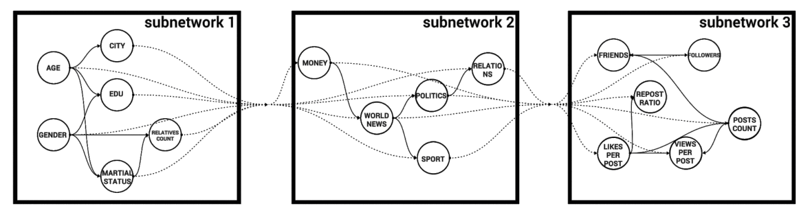

This repository contains a data modeling and analysis tool based on Bayesian networks. It can be divided into two main parts - algorithms for constructing and training Bayesian networks on data and algorithms for applying Bayesian networks for filling gaps, generating synthetic data, and searching for anomalous values.

Bayesian network learning
=========================
In terms of training Bayesian networks on data, the following algorithms are implemented:
- Building the structure of a Bayesian network based on expert knowledge by directly specifying the structure of the network;
- Building the structure of a Bayesian network on data using three algorithms - Hill Climbing, evolutionary and PC. For Hill Climbing, the following score functions are implemented - MI, K2, BIC, AIC. The algorithms work on both discrete and mixed data.
- Training the parameters of distributions in the nodes of the network on the basis of data.
Difference from existing implementations:
- Algorithms work on mixed data;
- Structural learning implements score-functions for mixed data;
- Parametric learning implements the use of a mixture of Gaussian distributions to approximate continuous distributions;
- The algorithm for structural training of large Bayesian networks (> 10 nodes) is based on local training of small networks with their subsequent algorithmic connection.

Generating synthetic data
=========================
In terms of data analysis and modeling using Bayesian networks, a pipeline has been implemented to generate synthetic data by sampling from Bayesian networks.

Oil and Gas Reservoirs Parameters Analysis
==========================================
Bayesian networks can be used to restore gaps in reservoirs data, search for anomalous values, and also to search for analogous reservoirs.

Functionality of the developed code:   

save_bn.py - Function for saving and reading a trained model from file.  

train_bn.py - Function for trainig the structure and parameters of BN from data.  

partial_bn_train.py - Function for adding new BN and trainig new connected BN with hidden vars.  

sampling.py - Function for generating synthetic data from BN model.  

calculate_accuracy.py - Function for estimation of prediction accuracy of BN.

mi_entopy_gauss.py - File with function for MI score calculattion on mixed data.

discretization.py - File with functions of data preprocessing.

quality_metrics.py - Function for quantifying the joint distribution of synthetic data

