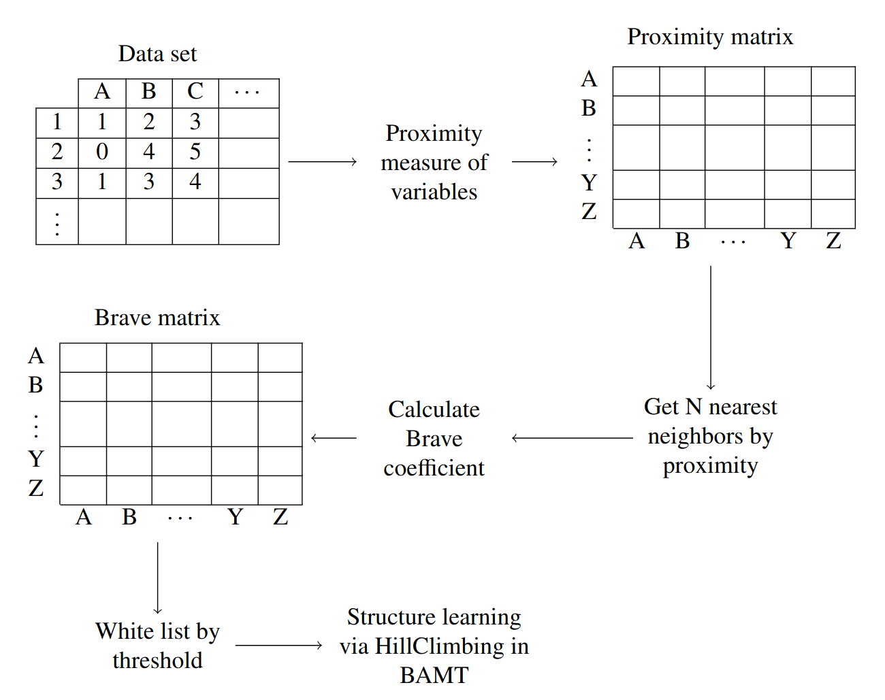

Algorithms for Large Bayesian Networks learning
===============================================

BigBraveBN
----------

The BigBraveBN has been built using BAMT, that was developed by our laboratory team. 
As an algorithm for finding the optimal structure of BN, we chose the greedy Hill-Climbing algorithm with the K2 score function, which we have already implemented in the BAMT library.
The idea of this algorithm is quite simple, we start searching for a structure from an empty graph and add, delete or reverse one edge at each iteration, and if the value of the score function improves, we fix this action with an edge.
To limit the search space, we propose our algorithm based on the Brave coefficient.
This coefficient measures the mutual occurrence of variables when clustering is applied to the data set. 
The algorithm of Brave coefficient calculation is shown in the following figure.

.. image:: ../../images/brave_coefficient_calculation.png
    :target:: ../../images/brave_coefficient_calculation.png
    :align: center

In the first step, we initialize a matrix that represents n nearest neighbours for every variable (groups).
In the second step for every pair of variables Brave coefficient is calculated using formula.

.. math:: 
    Br = \frac{a \times n + (a + c) \times (a + b)}{\sqrt{(a + c) \times (b + d)} + \sqrt{(a + b) \times (c + d)}}

In this formula, a is the number of groups in which both features fell, b and c are the numbers of groups in which one feature fell, but the second did not fall, d is the number of groups in which none of the features fell, n - dataset size.

Here is the workflow of the algorithm on the figure below.

* Initialize data set;
* Choose a proper proximity measure;
* Apply proximity measure to the data set;
* Get N nearest neighbors by proximity for every variable;
* Calculate Brave coefficient of mutual occurrence on nearest neighbors;
* Get Brave coefficient matrix;
* Generate white list of possible edges by setting a threshold;
* Perform structure learning via BAMT tools.

To form N-nearest neighbours different proximity measures can be used. But some of them have certain limitations.
Pearson correlation coefficient and MI metrics were reviewed for being used in the algorithm.
MI metric was chosen as a default metric due to its versatility and efficiency.

Here, when we run the Hill-Climbing algorithm, we limit the search space by giving the algorithm a so-called white list.
The white list is a predefined manually or by a certain algorithm list of edges, that limits the solution space by restricting any other connection except itemized in the white list.
Thus, the Bayesian Network can only consist of edges that are included in a specific white list.
